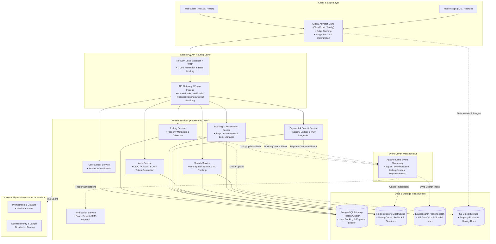

# High-Level Production Architecture: Vacation-Rental Marketplace

This document outlines the production-scale system architecture for a global vacation-rental platform (similar to Airbnb). It details the scaling strategies across traffic routing, domain microservices, data persistence, event-driven async workflows, caching, and observability.

---

## 1. System Architecture Diagram

Below is the high-level production architecture diagram visualizing synchronous request paths, asynchronous event streams, caches, persistent databases, and edge media distribution.

---

## 2. Layer-by-Layer Architectural Breakdown

### 2.1 Client & Edge Layer
- **Global Anycast CDN**: Serves static HTML/JS bundles and listing media. Performs on-the-fly image transformations (WebP/AVIF encoding, viewport-based responsive resizing) to optimize mobile and desktop page load performance.
- **WAF & DDoS Mitigation**: Sits at the edge to inspect incoming HTTP requests, enforce rate limits per IP/User, and block bot traffic/scraping attempts.

### 2.2 API Gateway & Security
- **Envoy / API Gateway**: Serves as the single entry point for all frontend API calls. Handles TLS termination, CORS validation, JWT signature verification, and dynamic upstream service routing.
- **Circuit Breaking & Rate Limiting**: Implemented at gateway level using Redis to prevent downstream cascading failures during peak search or flash-booking traffic.

### 2.3 Domain Services (Microservices on Kubernetes)
- **Listing Service**: Manages property details, room rules, host configurations, and booking calendar availability. Writes to PostgreSQL and invalidates Redis caches.
- **Search Service**: Powering search inputs, date range filtering, spatial geo-bounds querying (using Uber H3 spatial indexing), and ML-based recommendation ranking. Queries OpenSearch/Elasticsearch cluster for sub-50ms query latency.
- **Booking & Reservation Service**: Coordinates booking state transitions (`PENDING`, `CONFIRMED`, `CANCELLED`). Uses **Distributed Locks (Redlock)** to prevent double-booking race conditions during simultaneous reservations on the same date window. Implements the **Saga Pattern** for multi-step transaction management.
- **Payment & Payout Service**: Integrates with Payment Service Providers (Stripe, Adyen) to collect payments into escrow accounts and handle automated host payouts post check-in.
- **Notification Service**: Listens asynchronously to Kafka event topics to send transactional emails (AWS SES), mobile push notifications (FCM/APNS), and SMS receipts (Twilio).

### 2.4 Data Persistence & Event Architecture
- **Transactional Database (PostgreSQL)**: Multi-az cluster with primary write node and read replicas. Uses PgBouncer connection pooling and vertical/horizontal sharding by region.
- **Read Cache (Redis Cluster)**: In-memory cache for listing metadata, host profiles, session stores, and Redlock distributed locks.
- **Search Index (Elasticsearch/OpenSearch)**: Optimized for geo-distance queries and full-text keyword search. Synced asynchronously via Kafka consumer pipelines.
- **Object Storage (AWS S3)**: Multi-region S3 buckets for raw and processed listing images, PDF invoices, and host verification documents.

---

## 3. Practical Scaling Strategies

| Component | Scaling Strategy | Failure Mode & Resiliency |
|---|---|---|
| **Frontend Delivery** | Multi-region CDN edge caching with stale-while-revalidate headers. | Fallback to origin S3 static backup bucket if edge nodes fail. |
| **API Gateway** | Horizontal scaling via Kubernetes Horizontal Pod Autoscaler (HPA) based on CPU/Request count. | Rate limiting (429 Too Many Requests) & graceful degradation. |
| **Search Index** | Sharded OpenSearch cluster across availability zones; read replicas per shard. | Fallback to cached Postgres spatial query fallback if cluster is degraded. |
| **Booking Engine** | Redlock distributed locks with 5-second TTL; Saga state machine in PostgreSQL. | Idempotency key tracking prevents duplicate payment charges. |
| **Image Pipeline** | Edge worker image format transformation (WebP/AVIF) and S3 lifecycle storage. | CloudFront fallback to raw original JPEG image if optimization worker fails. |

---

## 4. Path Legend

- `──>` **Synchronous Request Path**: Direct HTTP/REST or gRPC client-to-service or service-to-database call.
- `- . ->` **Asynchronous Event Path**: Kafka topic event publish/subscribe streams or telemetry pipelines.
